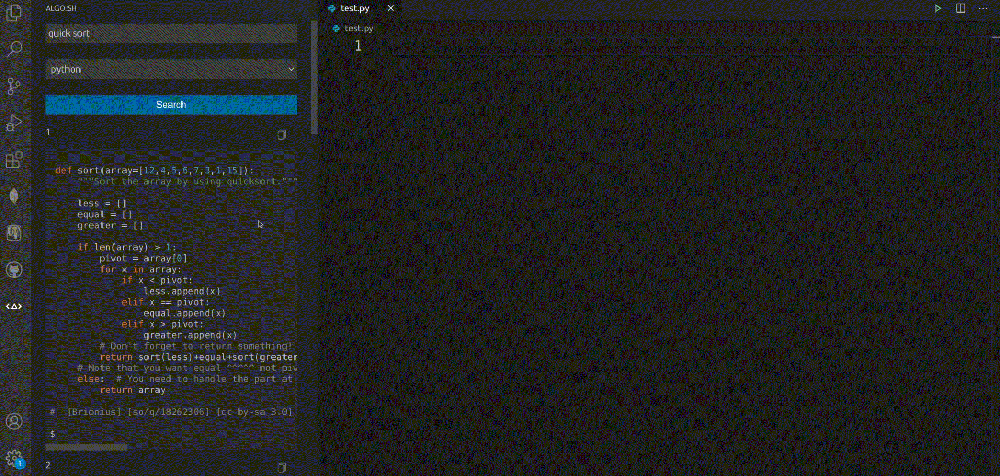
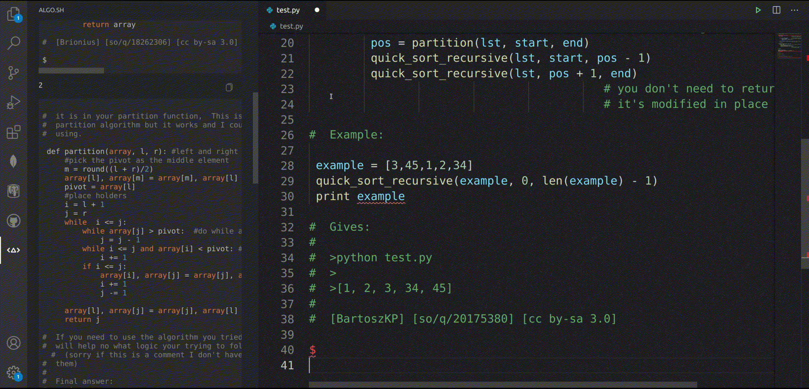

# algo-sh for vscode


algo.sh is a search engine for algorithms. It uses [cht.sh](https://cht.sh/) in the background, a cheatsheet tool for terminal. Found entries are returned in pages. Each entry is
a cheatsheet item (e.g. an instance for an algorithm) written by real individuals. For integration (.i.e atom, vim), you may check [algo.sh API](https://github.com/Dj-Polyester/algo.sh)



[Preview GIF](https://media.giphy.com/media/kcwpc5o0enZVdcG7S3/giphy.gif)

> ##### Help Wanted
>
> We need your help. algo.sh requests entries from [cht.sh](https://cht.sh/) for now. However, the entries may contain inaccurate results. Depending on your connection speed, the results may return slow (.i.e searching for an entry using a search engine). There are more features we want to add. Therefore, Please consider contributing to the project. Refer to
> [Contributing](#contributing) part for more information.

## Contents

- [Installation](#installation)
- [Usage](#usage)
- [Contributing](#contributing)
  - [Contributing to repository](#contributing-to-repository)
  - [Contributing to database](#contributing-to-database)
- [Extension Settings](#extension-settings)
- [Known Issues](#known-issues)
- [Release Notes](#release-notes)
- [Credits](#credits)

## Installation

The extension requires PostgreSQL. After downloading the extension and PostgreSQL, create a `.env` file with the
contents

```
PGUSER=[pgusername]
PGPASSWORD=[pgpassword]
PGDATABASE=algo
PGTABLE=[tablename]
```

`pgusername` and `pgpassword` are your postgres user's user name and password. You can write any `tablename` you want. The commands below are necessary before using the extension, because
postgres service may be disabled for default. To enable the
service for Windows:

```
tc start [postgresServiceName]
```

For MacOS

```
launchctl start [postgresServiceName]
```

For Linux; temporarily

```
systemctl start [postgresServiceName]
```

For Linux; permanently

```
systemctl enable [postgresServiceName]
```

> Note that the extension is tested in Ubuntu Linux only. Nodejs and vscode API are cross-compatible; however, the commands above are not tested in platforms other than Ubuntu Linux. For
> Ubuntu/Debian users, `postgresServiceName` is `postgresql.service`.

## Usage

1. Open the extension by clicking the logo on the left on the sidebar.
2. Type the cheatsheet you want to search for, then choose the language from the dropdown menu
3. Click _Search_ button
4. Results will appear, scroll and enjoy :)

## Contributing

### Contributing to repository

It is simple. Steps:

1. Open an issue
2. If you are allowed, commit your changes
3. Wait your changes to be published

Do not dm spam our contributors please.

### Contributing to database

We want to create our own database from scratch. However, it is
a daunting job. There are millions of algorithms to consider. Large is
formed little by little. Please send an implementation for an algorithm as plain text in steps below.

1. Open an issue with the label `entry`. The title should be the name of your algorithm.
2. Copy-paste your text and submit

Things to consider:

- Be sure that you use comments to make the text informative. Please
  use directives like `@param` and `@return` in Javascript for your functions.
- Languages like python and Javascript let expressions run in the global scope. Please avoid that. You may use global variables.
- Give your main function the name of the algorithm. This function will
  most likely be called by the user.
- When you are done, your work will look like below

```
...
FUNCTIONS AND GLOBAL VARIABLES WITH INFORMATIVE COMMENTS
...
<WORK> (c) by <AUTHOR(S)>

<WORK> is licensed under a
Creative Commons Attribution-ShareAlike 4.0 International License.

You should have received a copy of the license along with this
work. If not, see <http://creativecommons.org/licenses/by-sa/4.0/>
```

Don't be discouraged by that :D. We will fix minor parts of your text
according to the guidelines mentioned above.

## Extension Settings

This extension contributes the following settings:

- `algo-sh.load`: Specifies how many code blocks to load in a page
- `algo-sh.highlight`: Specifies the highlight theme for rendering code

## Known Issues

- No issues yet

## Release Notes

### 0.1.0

- Alpha release

## Credits

- Codebase from @Dj-Polyester

- Spinning wheel animation by Sergio Lozano from [www.lottiefiles.com](www.lottiefiles.com)
